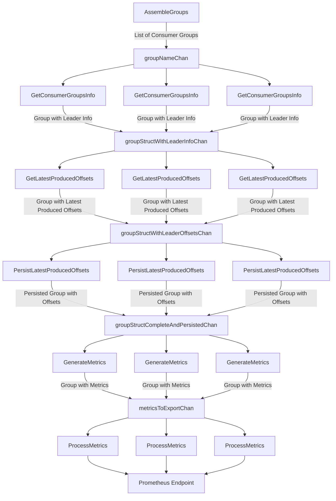

# Project Architecture Overview

Kafka Lag Go is designed using a modular, pipeline-based approach that efficiently manages data flow and processing tasks through Go’s concurrency model. Key to this design is the use of channels and goroutines, along with the careful handling of the `Group` structure to minimize unnecessary data copying. 

Each iteration of the process recalculates consumer group lag metrics, ensuring that the application provides an up-to-date snapshot of Kafka consumer group performance. By distributing tasks across multiple workers, the application processes large volumes of data efficiently.

### Detailed App Flow

1. **AssembleGroups**: This function retrieves the list of consumer groups from all Kafka servers, populates the `Group` struct with the group name, cluster name, and committed offsets. It also applies filters for the whitelist or blacklist of consumer groups.
  
2. **GetConsumerGroupsInfo**: This step fetches the partition leader for all partitions of the consumer groups, further populating the `Group` struct with partition leadership information.

3. **GetLatestProducedOffsets**: Organizes and sends requests to the corresponding Kafka brokers to get the latest produced offsets for the partitions, storing this information in the `Group` struct.

4. **PersistLatestProducedOffsets**: Stores the latest produced offsets in the configured storage entity (e.g., Redis).

5. **ProcessMetrics**: Aggregates the data, calculates lag metrics, and exposes them via the Prometheus metrics endpoint.

This pipeline ensures that Kafka Lag Go efficiently processes consumer group data and exports accurate lag metrics for monitoring through Prometheus.

### App Flow

## Key Structures

- **Group**: Represents a Kafka consumer group. Initially, only the `Name` and `ClusterName` fields are populated. As the Group object progresses through the pipeline, more fields are populated with relevant data such as offsets, lags, and topic details.
  - `Name`: The name of the consumer group.
  - `ClusterName`: The name of the Kafka cluster where the consumer group resides.
  - `Admin`: Interface to the Kafka admin client for managing the group.
  - `Client`: Interface to the Kafka client for producing/consuming data.
  - `SaramaConfig`: Sarama configuration for the Kafka client.
  - `Topics`: A list of topics associated with the consumer group.
  - `MaxLagInOffsets`: The maximum lag in offsets across all topics in the group.
  - `MaxLagInSeconds`: The maximum lag in seconds across all topics in the group.
  - `SumLagInOffsets`: The total lag in offsets across all topics in the group.
  - `SumLagInSeconds`: The total lag in seconds across all topics in the group.

- **Topic**: Represents a Kafka topic within a consumer group.
  - `Name`: The name of the topic.
  - `Partitions`: A list of partitions within the topic.
  - `SumLagInOffsets`: The total lag in offsets across all partitions in the topic.
  - `SumLagInSeconds`: The total lag in seconds across all partitions in the topic.
  - `MaxLagInOffsets`: The maximum lag in offsets across all partitions in the topic.
  - `MaxLagInSeconds`: The maximum lag in seconds across all partitions in the topic.

- **Partition**: Represents a partition within a Kafka topic.
  - `Number`: The partition number.
  - `CommitedOffset`: The committed offset for this partition.
  - `LatestProducedOffset`: The latest produced offset for this partition. A value of `0` can signify that the value has not yet been fetched or is unavailable.
  - `LatestProducedOffsetAt`: The timestamp when the latest produced offset was set. A value of `0` can signify that it has not been set.
  - `ProducedOffsetsHistory`: A slice storing the history of produced offsets. An empty slice can signify no history is available.
  - `LeaderBroker`: Interface to the leader broker for this partition, implemented using `*sarama.Broker` for consistency with Sarama API.
  - `LagInOffsets`: The calculated offset lag. A value of `0` can signify that it has not yet been calculated or there's no lag.
  - `LagInSeconds`: The calculated time lag in seconds. A value of `0` can signify that it has not yet been calculated or there's no lag.

## Scalability and Load Distribution

This system is designed with scalability in mind, ensuring that it can easily scale in or out based on the needs of the Kafka deployment. The use of consistent hashing plays a critical role in achieving this scalability. 

As the number of consumer groups grows, or as additional resources are required, the system can scale out by adding more nodes (e.g., through Kubernetes auto-scaling policies). Conversely, when fewer resources are needed, the system can scale down efficiently.

Consistent hashing automatically distributes the workload across the available nodes, ensuring that each node handles a balanced portion of the consumer groups. This dynamic distribution eliminates the need for manual resource allocation and prevents bottlenecks commonly associated with monolithic applications. 

In monolithic systems, the gap between fetching the latest produced offsets and committed offsets can widen, leading to inaccurate or even negative lag calculations. By contrast, this architecture maintains accurate and timely processing even as the system scales.

Additionally, when querying Kafka brokers for partition leaders, the system optimizes load distribution by assembling requests per broker, targeting only the partitions they lead. This approach ensures that the requests for a consumer group’s topic partitions are evenly distributed among brokers, enhancing the performance and reliability of the system.

## Pipeline Model: Group Structure and Data Flow

The `Group` structure is created for each Kafka consumer group, and it serves as the core entity that moves through the different stages of the pipeline. Each `Group` is passed by reference among the various steps, ensuring that all updates and modifications are made in place without creating unnecessary copies. This approach provides several key advantages:

- **Isolation of Data**: Each `Group` represents an isolated entity that is never accessed concurrently by multiple goroutines. This ensures thread safety without the need for locks or complex synchronization mechanisms.
  
- **Passing by Reference**: Instead of copying the `Group` structure at each stage, we send a reference to the `Group` through the channels. Since the `Group` is never accessed in parallel by different goroutines, passing a reference eliminates the overhead of copying and reduces memory usage, ensuring efficient data handling.

- **Progressive Population**: The `Group` starts as an empty structure with only the consumer group name and cluster name initialized. At each step in the pipeline, new data is populated in the `Group` that is required for subsequent steps, such as consumer offsets, partition leader information, and produced offsets.

- **Efficient Data Flow**: As soon as a `Group` completes a step, it is sent to a channel where the next step in the pipeline can pick it up and continue processing. This asynchronous handoff allows for parallel processing, ensuring that multiple `Group` structures can be in different stages of the pipeline without interfering with each other.

- **High Throughput**: By using this model, the application can process many `Group` structures simultaneously, with each group progressing through the pipeline independently. This design enables a high throughput of groups, allowing the system to efficiently handle large volumes of Kafka consumer groups even at different stages of the processing pipeline.

This approach of passing the `Group` structure by reference through a series of channels ensures scalability and efficient resource usage, while keeping the overall system flexible and modular.

## Storage

### Redis-Based

The storage layer of this project is currently supported by Redis. Redis is leveraged for its high performance and ability to handle large-scale data with efficiency. The design of the storage interactions is focused on minimizing latency and maximizing throughput, particularly when dealing with Kafka consumer group data.

- Batch Operations:
	- Redis pipelines are utilized to batch requests when retrieving or writing the latest produced offsets for all partitions within topics per consumer group. This batching of requests significantly reduces the round-trip time (RTT) involved in these operations, leading to faster overall performance.
	- Batch operations save a considerable amount of time by reducing the overhead associated with multiple network calls, enabling the system to handle large volumes of data more efficiently.

- Atomic Operations with Lua Scripts:
	- For operations that require atomicity, such as node synchronization, registering, and removing nodes, the project uses Lua scripts. These scripts are registered on the Redis server side, and only the hash of the script is passed during each execution.
	- This method ensures that operations are executed atomically, avoiding race conditions and ensuring data consistency across distributed nodes.

- Cleanup Process:
	- To manage data retention, a probabilistic cleanup process is implemented. Every time a key is written, there is a 20% chance that a cleanup operation is triggered. This cleanup process involves using ZRANGE operations to remove old entries based on a time retention policy.
	- Additionally, every time a key is updated, its Time-To-Live (TTL) is refreshed. This ensures that both the keys and their respective items remain alive as long as the TTL is continuously updated, preventing premature expiration of relevant data.

## Summary

This architecture is built on a modular, pipeline-based approach utilizing Go’s powerful concurrency model to manage and process Kafka consumer group data efficiently. By strategically employing channels and goroutines, the system ensures that each stage of the data processing pipeline operates independently and concurrently, allowing for scalable and parallel processing of consumer groups.

The Group structure, a central element in the pipeline, is initialized early and passed by pointer through each stage of processing. This approach minimizes the overhead associated with data copying, ensuring optimal performance even as the pipeline handles large volumes of data.

At each stage, specialized goroutines work on isolated tasks—fetching consumer group details, retrieving the latest produced offsets, persisting data, and generating metrics—before passing the enriched Group structure to the next stage. This design ensures that data is consistently updated and that each stage of processing can operate without interfering with others.

By the end of the pipeline, the processed and enriched data is exported to a Prometheus endpoint, where it can be used for real-time monitoring of Kafka consumer groups. This architecture not only supports high scalability but also ensures that the system is robust, efficient, and capable of handling large-scale Kafka deployments with ease.
