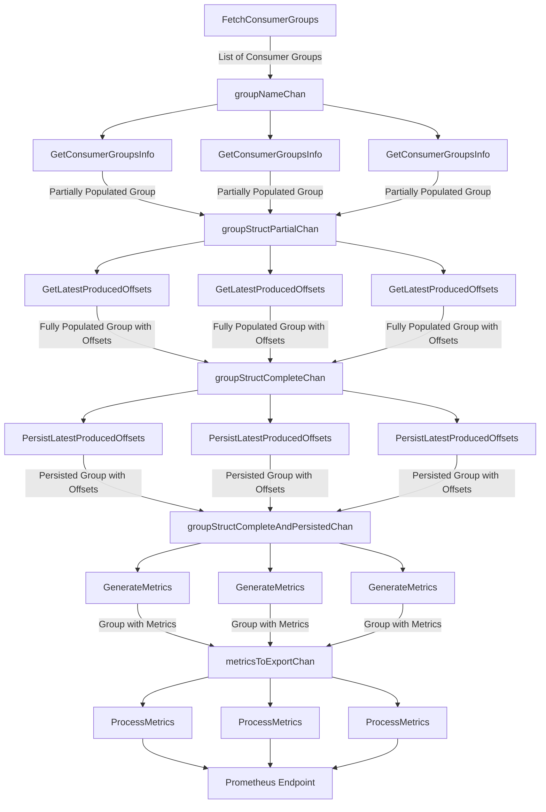

# Project Architecture Overview
The architecture of this project is designed using a modular, pipeline-based approach that efficiently manages data flow and processing tasks through Go’s concurrency model. Key to this design is the use of channels and goroutines, combined with the careful handling of the Group structure to minimize unnecessary copying of data. The entire process is defined by iterations, where the application periodically calculates the lag metrics based on the latest data. These iterations ensure that the lag information is consistently up-to-date and accurately reflects the current state of the Kafka consumer groups.

## App flow

## Key Structures
- Group: Represents a Kafka consumer group. It starts as an incomplete object, with only the Name field initialized. As the Group object progresses through the pipeline, its fields are populated with the necessary data.
  - Name: The name of the consumer group.
  - Topics: A list of topics associated with the consumer group.
  - MaxLagInOffsets: The maximum lag in offsets across all topics in the group.
  - MaxLagInSeconds: The maximum lag in seconds across all topics in the group.
  - SumLagInOffsets: The total lag in offsets across all topics in the group.
  - SumLagInSeconds: The total lag in seconds across all topics in the group.
- Topic: Represents a Kafka topic within a consumer group.
  - Name: The name of the topic.
  - Partitions: A list of partitions within the topic.
  - SumLagInOffsets: The total lag in offsets across all partitions in the topic.
  - SumLagInSeconds: The total lag in seconds across all partitions in the topic.
  - MaxLagInOffsets: The maximum lag in offsets across all partitions in the topic.
  - MaxLagInSeconds: The maximum lag in seconds across all partitions in the topic.
- Partition: Represents a partition within a Kafka topic.
  - Number: The partition number.
  - CommitedOffset: The committed offset for this partition.
  - LatestProducedOffset: The latest produced offset for this partition.
  - LatestProducedOffsetAt: The timestamp when the latest produced offset was set.
  - ProducedOffsetsHistory: A slice storing the history of produced offsets.
  - LeaderBroker: Interface to the leader broker for this partition.
  - LagInOffsets: The calculated offset lag.
  - LagInSeconds: The calculated time lag in seconds.

## Architecture Workflow explained
1. FetchConsumerGroups:
	- The process begins with the FetchConsumerGroups function, which retrieves a list of all consumer groups in the Kafka cluster.
2. Channel: groupNameChan:
	- The list of consumer groups is sent into the groupNameChan channel. This channel transports the names of the consumer groups to the next processing stage.
3. GetConsumerGroupsInfo (Goroutines):
	- Multiple goroutines, managed by GetConsumerGroupsInfo, read from groupNameChan.
	- Each goroutine fetches detailed information about the consumer group, including topics, partitions, leader brokers, and committed offsets.
	- A Group structure is initialized for each consumer group, and this structure is passed by pointer through the channels to avoid copying large amounts of data multiple times. The populated Group pointer is then sent to the groupStructPartialChan channel.
4. Channel: groupStructPartialChan:
	- The groupStructPartialChan channel holds partially populated Group pointers, ready for further processing.
5. GetLatestProducedOffsets (Goroutines):
	- Another set of goroutines, running the GetLatestProducedOffsets function, reads from groupStructPartialChan.
	- These goroutines fetch the latest produced offsets for each partition in the group, updating the Group structure.
	- The updated Group pointer is then sent to the groupStructCompleteChan channel.
6. Channel: groupStructCompleteChan:
	- The groupStructCompleteChan channel carries fully populated Group pointers, including the latest produced offsets.
7. PersistLatestProducedOffsets (Goroutines):
	- Goroutines running the PersistLatestProducedOffsets function read from groupStructCompleteChan.
	- These goroutines persist the latest produced offsets to the persistent storage and update the Group structure with this information.
	- The Group pointer is then sent to groupStructCompleteAndPersistedChan.
8. Channel: groupStructCompleteAndPersistedChan:
	- This channel holds fully processed and persisted Group pointers, ready for metric generation.
9. GenerateMetrics (Goroutines):
	- The GenerateMetrics function spawns goroutines that read from groupStructCompleteAndPersistedChan.
	- These goroutines calculate the relevant metrics, such as lag in offsets and seconds at both the consumer group and topic levels.
	- The metrics are added to the Group structure, which is then sent to metricsToExportChan.
10. Channel: metricsToExportChan:
	 - The metricsToExportChan channel carries Group pointers, now enriched with calculated metrics, to the final stage.
11. ProcessMetrics (Goroutines):
	 - Finally, goroutines running the ProcessMetrics function read from metricsToExportChan.
	 - These goroutines export the metrics to a Prometheus endpoint, making them available for monitoring.

## Scalability and Load Distribution

This system is designed with scalability in mind, ensuring that it can easily scale in or out based on the needs of the Kafka deployment. The use of consistent hashing plays a critical role in achieving this scalability. 

As the number of consumer groups grows, or as additional resources are required, the system can scale out by adding more nodes (e.g., through Kubernetes auto-scaling policies). Conversely, when fewer resources are needed, the system can scale down efficiently.

Consistent hashing automatically distributes the workload across the available nodes, ensuring that each node handles a balanced portion of the consumer groups. This dynamic distribution eliminates the need for manual resource allocation and prevents bottlenecks commonly associated with monolithic applications. 

In monolithic systems, the gap between fetching the latest produced offsets and committed offsets can widen, leading to inaccurate or even negative lag calculations. By contrast, this architecture maintains accurate and timely processing even as the system scales.

Additionally, when querying Kafka brokers for partition leaders, the system optimizes load distribution by assembling requests per broker, targeting only the partitions they lead. This approach ensures that the requests for a consumer group’s topic partitions are evenly distributed among brokers, enhancing the performance and reliability of the system.

## Storage

### Redis-Based

The storage layer of this project is currently supported by Redis. Redis is leveraged for its high performance and ability to handle large-scale data with efficiency. The design of the storage interactions is focused on minimizing latency and maximizing throughput, particularly when dealing with Kafka consumer group data.

- Batch Operations:
	- Redis pipelines are utilized to batch requests when retrieving or writing the latest produced offsets for all partitions within topics per consumer group. This batching of requests significantly reduces the round-trip time (RTT) involved in these operations, leading to faster overall performance.
	- Batch operations save a considerable amount of time by reducing the overhead associated with multiple network calls, enabling the system to handle large volumes of data more efficiently.

- Atomic Operations with Lua Scripts:
	- For operations that require atomicity, such as node synchronization, registering, and removing nodes, the project uses Lua scripts. These scripts are registered on the Redis server side, and only the hash of the script is passed during each execution.
	- This method ensures that operations are executed atomically, avoiding race conditions and ensuring data consistency across distributed nodes.

- Cleanup Process:
	- To manage data retention, a probabilistic cleanup process is implemented. Every time a key is written, there is a 20% chance that a cleanup operation is triggered. This cleanup process involves using ZRANGE operations to remove old entries based on a time retention policy.
	- Additionally, every time a key is updated, its Time-To-Live (TTL) is refreshed. This ensures that both the keys and their respective items remain alive as long as the TTL is continuously updated, preventing premature expiration of relevant data.

## Summary

This architecture is built on a modular, pipeline-based approach utilizing Go’s powerful concurrency model to manage and process Kafka consumer group data efficiently. By strategically employing channels and goroutines, the system ensures that each stage of the data processing pipeline operates independently and concurrently, allowing for scalable and parallel processing of consumer groups.

The Group structure, a central element in the pipeline, is initialized early and passed by pointer through each stage of processing. This approach minimizes the overhead associated with data copying, ensuring optimal performance even as the pipeline handles large volumes of data.

At each stage, specialized goroutines work on isolated tasks—fetching consumer group details, retrieving the latest produced offsets, persisting data, and generating metrics—before passing the enriched Group structure to the next stage. This design ensures that data is consistently updated and that each stage of processing can operate without interfering with others.

By the end of the pipeline, the processed and enriched data is exported to a Prometheus endpoint, where it can be used for real-time monitoring of Kafka consumer groups. This architecture not only supports high scalability but also ensures that the system is robust, efficient, and capable of handling large-scale Kafka deployments with ease.
